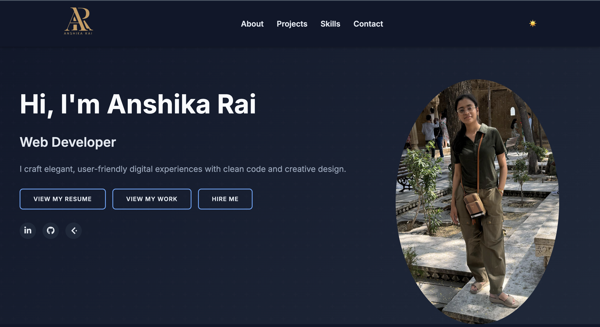
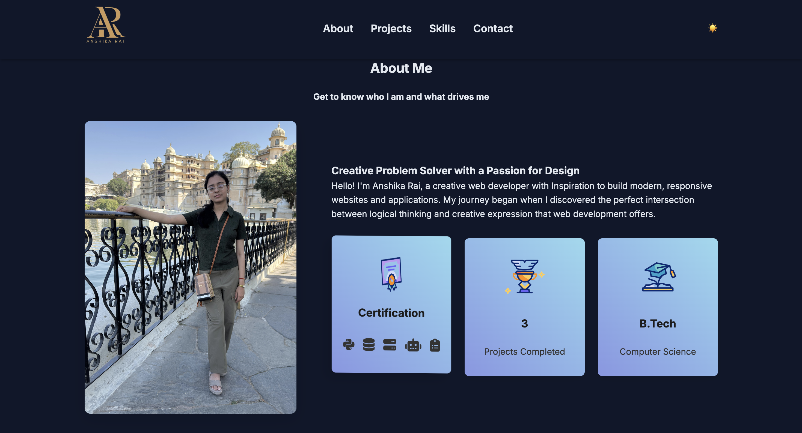
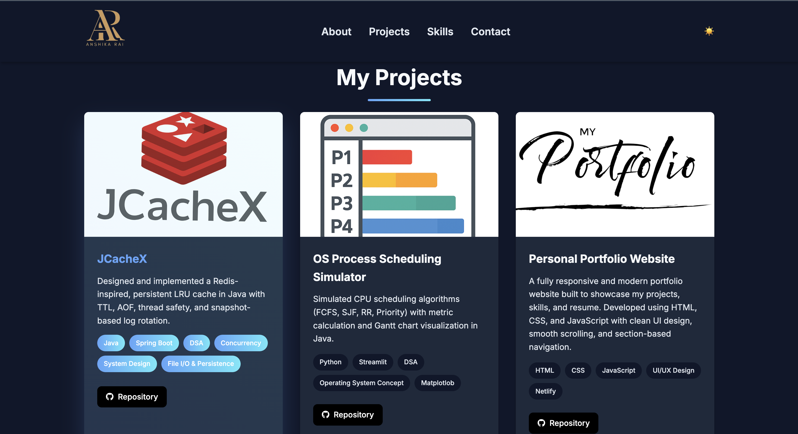
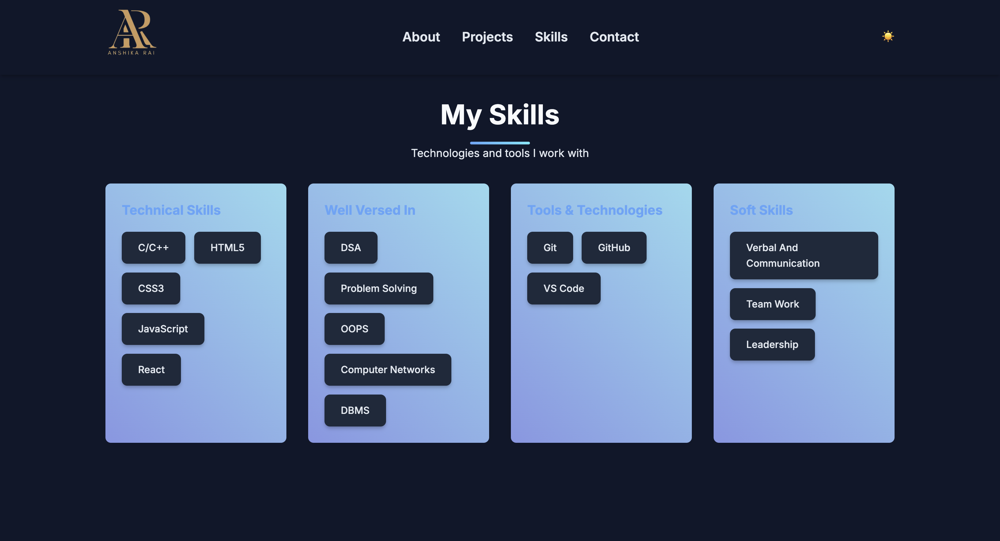
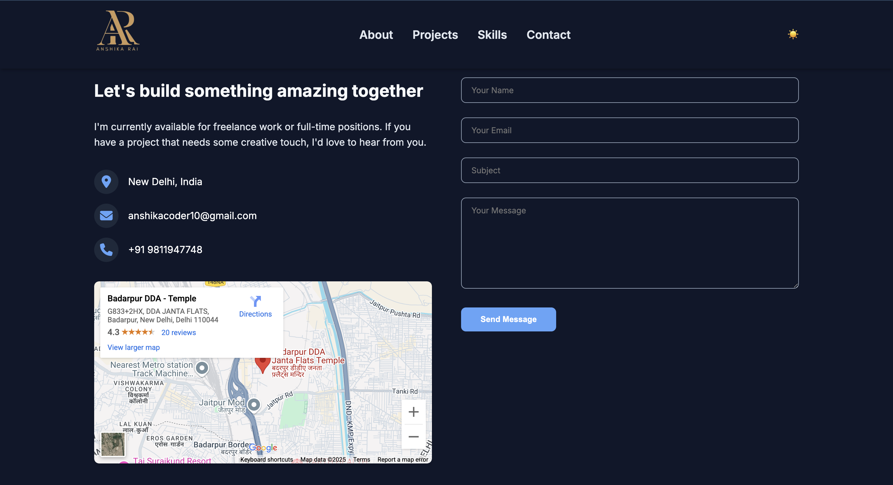

# 🌐 Anshika Rai – Portfolio Website

Welcome to my personal developer portfolio!  
I’m Anshika Rai, a passionate Web Developer and Computer Science undergraduate. This portfolio is a reflection of my skills, projects, and personality – built with clean UI, elegant animations, and modern frontend practices.

---

## ✨ Live Preview

🔗 [Visit My Website](https://your-deployed-site-url.com)  
*(Update this with your actual deployed site, e.g., Netlify, GitHub Pages, Vercel, etc.)*

---

## 📸 Screenshots

### 🔹 Landing Page

### 🔹 About Me Section

### 🔹 Projects Section

### 🔹 Skills Section

### 🔹 Contact Section

---

## 💡 Features

- Clean and modern UI
- Fully responsive across all devices
- Dark mode support ☀️🌙
- Animated transitions
- Section-based navigation
- Downloadable resume
- Contact form with integrated map

---

## 🛠 Tech Stack

- **Frontend**: HTML5, CSS3, JavaScript
- **Frameworks**: React.js
- **Animations**: CSS animations, smooth scroll
- **Deployment**: Netlify / GitHub Pages
- **Tools**: Git, VS Code, GitHub

---

## 🧠 Skills Highlighted

### 💻 Technical Skills
- C/C++, JavaScript, HTML5, CSS3, React

### 📚 Computer Science Core
- DSA, OOPS, DBMS, Computer Networks, OS

### 🔧 Tools
- Git, GitHub, VS Code

### 💬 Soft Skills
- Teamwork, Leadership, Communication

---

## 📁 Projects Featured

### 🔸 [JCacheX](https://github.com/yourusername/jcachex)
A Redis-inspired Java cache with TTL, AOF persistence, log rotation, and thread safety.

### 🔸 [OS Process Scheduling Simulator](https://github.com/yourusername/os-scheduler)
CPU scheduling simulator in Java with FCFS, SJF, RR, and Priority + Gantt chart.

### 🔸 [Portfolio Website](https://github.com/yourusername/portfolio)
This website – built with HTML, CSS, JavaScript, and smooth animations.

---

## 📬 Contact Me

- 📍 New Delhi, India  
- 📧 Email: [anshikacoder10@gmail.com](mailto:anshikacoder10@gmail.com)  
- 📞 Phone: +91 98119 47748  
- 🔗 [LinkedIn](https://www.linkedin.com/in/your-link) | [GitHub](https://github.com/yourusername)

---

## 🙌 Let's Collaborate

I'm open to:
- Internships & Freelance opportunities
- Backend, Frontend, or Full-Stack roles
- Creative tech collaborations

Let’s build something amazing together! 🚀

---

> _“Creativity is intelligence having fun.” – Albert Einstein_

